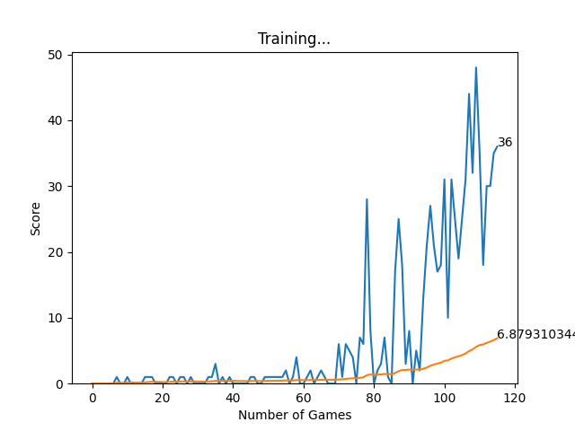

# Snake Game using PyTorch

This is a simple snake game implemented using PyTorch, where the player controls a snake to eat food and grow longer while avoiding collisions with walls or its own body. It demonstrates the basic concepts of game development and reinforcement learning using PyTorch.

## Features

- Classic snake game mechanics: eat food, grow longer, avoid collisions.
- PyTorch implementation for Reinforcement Learning Algorithms.
- Neural Network-based snake AI using Deep Q-Learning.
- Simple graphical interface using PyGame library.

## Installation

1. Clone the repository:

```shell
git clone https://github.com/ArnabKumarRoy02/Snake-Game-Pytorch.git
```

2. Change the working directory:

```shell
cd Snake-Game-Pytorch
```

3. Install the dependencies:

```shell
pip install -r requirements.txt
```

## Usage

To play the game manually, run the following command:

```shell
python snake_game_human.py
```

You can control the snake movements using the arrow keys.

To train the AI agent using Deep Q-Learning, run the following command:

```shell
python agent.py
```

## Screenshots


<br>
<p style="text-align: center;">Video Implementation of the game</p>
<br>

<div>
  
  <br>
  <p style="text-align: center;">Score vs Number of Games graph</p>
</div>

## Contributing

Pull requests are welcome. For major changes, please open an issue first to discuss what you would like to change.

## License

This project is licensed under the [MIT License](LICENSE).

## Acknowledgements

This project was inspired by the classic snake game and the concepts of reinforcement learning. Thanks to the PyTorch and Pygame communities for their valuable resources and documentation.
